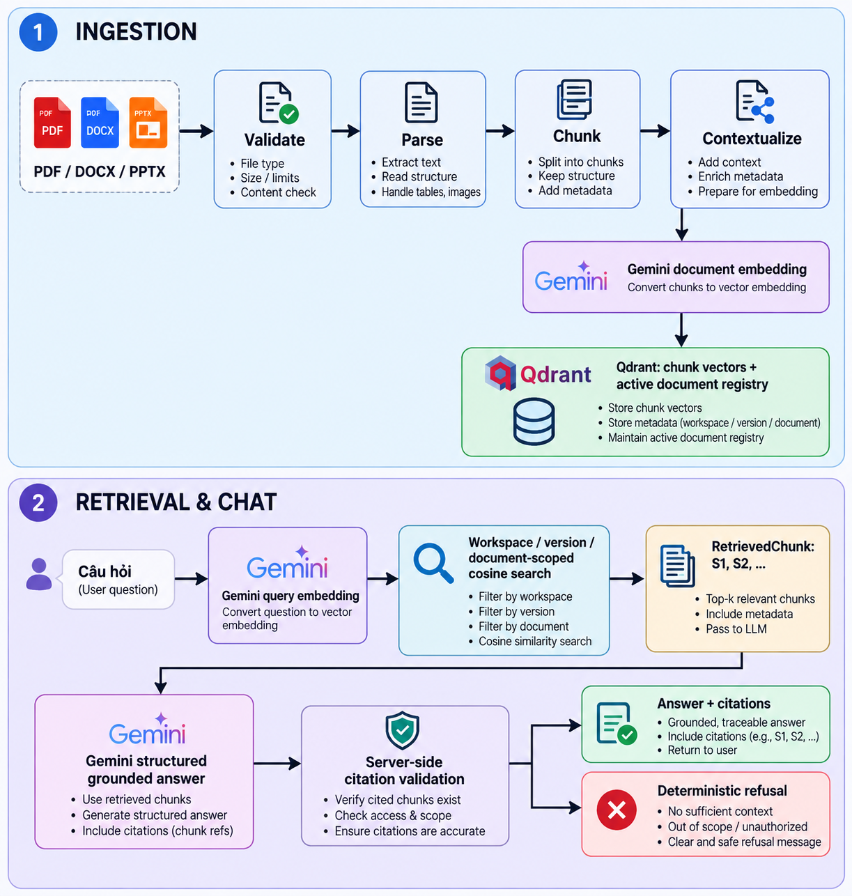

# Study Assistant

<p align="center">
  
  <a href="https://github.com/TUDONG05/study-assistant-rag/actions/workflows/ci.yml"></a>
  
  
  
  
</p>

Trợ lý học tập tiếng Việt sử dụng pipeline **Retrieval-Augmented Generation (RAG)** end-to-end để biến tài liệu cá nhân thành nguồn kiến thức có thể truy vấn. Người dùng có thể tải lên PDF, DOCX hoặc PPTX, lập chỉ mục nội dung và đặt câu hỏi; hệ thống trả lời kèm trích dẫn tới đúng file, trang, slide hoặc mục nguồn.

Study Assistant hiện cung cấp một **dense grounded RAG baseline** hoàn chỉnh. Pipeline được triển khai trực tiếp bằng Gemini SDK và Qdrant để từng bước xử lý đều minh bạch, có thể kiểm thử và dễ mở rộng, thay vì bị ẩn sau một orchestration framework.

## Điểm nổi bật

- Hỗ trợ ingestion cho PDF, DOCX và PPTX, đồng thời giữ metadata phục vụ trích dẫn.
- Kiểm tra file phòng thủ: extension, MIME, PDF signature, OpenXML structure, ZIP path traversal, archive encryption và giới hạn dữ liệu giải nén.
- Chunk theo ranh giới câu và block nguồn, có overlap cùng ID xác định.
- Tách `retrieval_text` đã bổ sung ngữ cảnh khỏi `original_text` dùng làm bằng chứng trích dẫn.
- Context deterministic mặc định; Gemini enrichment là tùy chọn và có fallback an toàn theo từng chunk.
- Gemini Embedding 2 theo batch, retry có backoff và kiểm tra số lượng/dimension vector trả về.
- Qdrant lưu vector theo workspace, hỗ trợ deduplication, versioning, staged replacement và rollback khi ingestion lỗi.
- Dense retrieval chỉ tìm trong document version đang active và phạm vi tài liệu người dùng đã chọn.
- Gemini trả structured JSON; citation `[S1]`, `[S2]` được server đối chiếu với các chunk thực tế.
- Từ chối có kiểm soát khi không có đủ bằng chứng hoặc response/citation không hợp lệ.
- Bộ benchmark tiếng Việt có phiên bản, đo retrieval, answerability, citation, fact coverage,
  query drift, độ trễ và chi phí ước tính trên cùng một hold-out.

## Kiến trúc tổng thể

<p align="center">
  
</p>

<p align="center"><em>Luồng xử lý từ tài liệu đầu vào đến câu trả lời có trích dẫn.</em></p>

### Nguyên tắc dữ liệu

Mỗi chunk duy trì hai dạng văn bản với mục đích khác nhau:

| Dữ liệu | Mục đích |
| --- | --- |
| `retrieval_text` | Chứa context prefix và nội dung chunk, dùng để tạo embedding và tăng khả năng truy xuất |
| `original_text` | Văn bản gốc từ tài liệu, dùng làm evidence và supporting quote trong citation |

Thiết kế này cho phép tăng chất lượng retrieval mà không làm thay đổi nội dung được trình bày như bằng chứng cho người dùng.

## Công nghệ sử dụng

| Thành phần | Công nghệ |
| --- | --- |
| Ngôn ngữ | Python 3.11+ |
| Giao diện | Streamlit 1.63 |
| LLM và embedding | Google Gen AI SDK, Gemini |
| Vector database | Qdrant |
| PDF parser | PyPDF |
| DOCX parser | python-docx |
| PPTX parser | python-pptx |
| Quality tooling | pytest, Ruff, mypy |

Project chủ động không dùng LangChain ở baseline hiện tại. Các interface riêng cho embedding, retrieval và storage giữ dependency rõ ràng, đồng thời vẫn cho phép bổ sung framework hoặc chiến lược retrieval khác khi thật sự cần.

## Bắt đầu nhanh

### Yêu cầu

- Python 3.11 trở lên.
- Gemini API key cá nhân để tạo embedding và câu trả lời.
- Không cần Qdrant Cloud nếu sử dụng storage mode mặc định `local`.

### Cài đặt bằng `venv` và `pip`

```bash
git clone git@github.com:TUDONG05/study-assistant-rag.git
cd study-assistant-rag

python -m venv env
source env/bin/activate
pip install -r requirements-dev.txt

cp .streamlit/secrets.toml.example .streamlit/secrets.toml
streamlit run app.py
```

Nếu đã cài `uv`, có thể thay bước tạo môi trường và cài dependency bằng:

```bash
uv sync
uv run streamlit run app.py
```

Gemini sử dụng mô hình BYOK: nhập API key trong sidebar sau khi ứng dụng khởi động. Key chỉ tồn tại trong Streamlit session hiện tại, không được lưu vào vector database hoặc ghi vào log.

## CI/CD

GitHub Actions chạy workflow lint (actionlint), lint (Ruff), type-check (mypy), test (pytest)
và kiểm tra lỗ hổng dependency (`pip-audit`) trên mọi pull request và mọi lần push. Môi trường
Python 3.11 được tái lập từ `uv.lock` bằng `uv sync --locked --group dev`; CI sẽ fail nếu lockfile
không khớp manifest.

Workflow `Deploy` triển khai vào **staging** sau khi CI của nhánh `develop` thành công và vào
**production** sau khi CI của nhánh `main` thành công. Chạy thủ công vẫn là deploy production.
Vì workflow `workflow_run` phải tồn tại trên nhánh mặc định, hãy merge thay đổi workflow này vào
`main` trước khi kỳ vọng deploy tự động chạy.
Để bật các deploy hook, cấu hình tại repository GitHub:

1. Cho production: thêm **Repository variable** `DEPLOY_ENABLED=true`, **Repository secrets**
   `DEPLOY_HOOK_URL` (URL webhook deploy) và `PRODUCTION_HEALTHCHECK_URL`.
2. Cho staging: thêm **Repository variable** `STAGING_DEPLOY_ENABLED=true`, **Repository secrets**
   `STAGING_DEPLOY_HOOK_URL` và `STAGING_HEALTHCHECK_URL`.

Deploy chỉ được ghi nhận thành công khi health-check trả về HTTP 2xx và header `X-Deployment-SHA` khớp SHA đã được deploy. Deploy hook phải dùng header `X-Deployment-SHA` làm idempotency key và triển khai đúng revision đó. Bảo vệ `main` và
`develop` bằng required status checks `Validate GitHub Actions workflows` và `Lint, type-check,
and test`; đồng thời bật GitHub secret scanning, push protection và Dependabot security updates.

Nếu ứng dụng được kết nối trực tiếp với Streamlit Community Cloud qua GitHub, việc push lên
nhánh deploy tương ứng của Streamlit Cloud đã tự kích hoạt deploy; không cần đặt webhook cho
môi trường đó.

## Cách sử dụng

### 1. Lập chỉ mục tài liệu

1. Mở màn hình **Tài liệu**.
2. Chọn một hoặc nhiều file PDF, DOCX hoặc PPTX.
3. Chọn **Lập chỉ mục tài liệu**.
4. Chờ pipeline validate, parse, chunk, contextualize, embed và commit document version.

Deterministic context được bật mặc định. Gemini context enrichment là tùy chọn vì làm tăng độ trễ và API usage; nếu enrichment thất bại, hệ thống fallback về deterministic context thay vì loại bỏ toàn bộ tài liệu.

### 2. Hỏi đáp có trích dẫn

1. Mở màn hình **Chat**.
2. Chọn các tài liệu muốn dùng làm phạm vi tìm kiếm; để trống nghĩa là dùng tất cả tài liệu active tương thích.
3. Nhập câu hỏi.
4. Kiểm tra citation `[S1]`, `[S2]` và source panel để xem file, vị trí, supporting quote và retrieval score.

Retrieval score là metadata dùng để xếp hạng độ tương đồng, không phải xác suất câu trả lời đúng.

### 3. Chạy dense baseline

Lập chỉ mục `Nhóm3_TTCSN.docx` trong storage local, đóng Streamlit để giải phóng khóa Qdrant,
đặt API key trong terminal rồi chạy:

```bash
export GEMINI_API_KEY="..."
uv run python -m scripts.evaluate_rag --split holdout
```

CLI chạy 22 ca hold-out và ghi `evaluations/results/latest.json` cùng báo cáo Markdown. Màn hình
**Đánh giá** tự đọc kết quả gần nhất. Corpus gốc không nằm trong repository; bộ nhãn hiện có 46
ca và chỉ sử dụng tài liệu đã được chủ dự án cho phép.

## Cấu hình

Thứ tự ưu tiên cấu hình:

```text
Environment variables → Streamlit secrets → safe defaults
```

Các biến chính:

| Biến | Mặc định | Ý nghĩa |
| --- | --- | --- |
| `CHAT_MODEL` | `gemini-3.5-flash-lite` | Model tạo câu trả lời |
| `EMBEDDING_MODEL` | `gemini-embedding-2` | Model tạo vector |
| `EMBEDDING_DIMENSION` | `768` | Số chiều vector |
| `STORAGE_MODE` | `local` | Chế độ lưu trữ Qdrant |
| `QDRANT_PATH` | `.data/qdrant` | Đường dẫn Qdrant local |
| `MAX_UPLOAD_MB` | `25` | Dung lượng tối đa mỗi file |
| `MAX_DOCUMENT_PAGES` | `300` | Số trang tối đa được parse |
| `CHUNK_SIZE_CHARS` | `1600` | Kích thước chunk mục tiêu |
| `CHUNK_OVERLAP_CHARS` | `240` | Phần overlap giữa các chunk |
| `RETRIEVAL_TOP_K` | `6` | Số candidate tối đa |
| `RETRIEVAL_SCORE_THRESHOLD` | `0.5` | Ngưỡng cosine score |
| `MAX_QUESTION_CHARS` | `4000` | Độ dài câu hỏi tối đa |
| `MAX_REQUESTS_PER_SESSION` | `40` | Giới hạn request mỗi session |

Danh sách đầy đủ và validation rule nằm trong `src/config.py`. Có thể sao chép `.streamlit/secrets.toml.example` để ghi đè các giá trị cần thiết.

### Storage modes

| Mode | Cách hoạt động | Phù hợp với |
| --- | --- | --- |
| `local` | Lưu bền vững trong `.data/qdrant` | Phát triển và sử dụng single-user |
| `demo` | Qdrant in-memory, tách theo browser session | Demo tạm thời, không cần dữ liệu bền vững |
| `cloud` | Kết nối Qdrant qua `QDRANT_URL` và `QDRANT_API_KEY` | Môi trường remote; hiện identity vẫn dựa trên session |

## Cấu trúc mã nguồn

```text
study-assistant-rag/
├── app.py                  # Streamlit entry point
├── src/
│   ├── ingestion/          # Validate, parse, chunk, context, embed và index
│   ├── storage/            # Qdrant collections, document registry và vector store
│   ├── retrieval/          # Dense retriever và trusted retrieval models
│   ├── chat/               # Grounded generation và citation validation
│   ├── evaluation/         # Dataset contract, runner, metrics và reporting
│   ├── ui/                 # Documents, chat, evaluation và study-tool views
│   ├── clients.py          # Gemini và Qdrant client lifecycle
│   └── config.py           # Typed configuration và validation
├── evaluations/            # Versioned labels và benchmark results
├── scripts/                # Evaluation CLI
├── tests/                  # Unit/integration/UI tests
└── pyproject.toml          # Dependencies và tool configuration
```

## An toàn và độ tin cậy

- Không tin hoàn toàn vào extension hoặc MIME do upload cung cấp; hệ thống kiểm tra cả nội dung file.
- Giới hạn upload, số trang, extracted characters, ZIP entries và kích thước giải nén để giảm rủi ro resource exhaustion.
- Mọi thao tác query/delete/count đều có workspace filter.
- Retrieval xây allowlist từ active `DocumentRecord` và kiểm tra lại payload sau khi Qdrant trả kết quả.
- Question, conversation history và source text được đóng trong vùng JSON không đáng tin cậy để giảm prompt injection.
- Gemini response phải đúng JSON schema; citation marker và source ID được xác thực phía server.
- Provider error được chuyển thành thông báo an toàn, không đưa raw prompt, API key hoặc response ra UI.

Citation validation xác nhận cấu trúc marker và nguồn được phép sử dụng. Benchmark Phase 5 đo
thêm citation precision, recall, coverage và expected-fact coverage; các chỉ số này vẫn phụ thuộc
chất lượng nhãn và không phải là bằng chứng toán học cho mọi mệnh đề.

## Kiểm thử

```bash
uv run --with-requirements requirements-dev.txt python -m ruff check src tests app.py
uv run --with-requirements requirements-dev.txt python -m mypy src
uv run --with-requirements requirements-dev.txt python -m pytest
```

Bộ test hiện tại bao phủ cấu hình, client lifecycle, ingestion, Qdrant storage, retrieval scope,
grounded chat, citation contract, evaluation metrics/runner, session state và Streamlit navigation.
Lần xác minh gần nhất có **118 test passed**.

## Phạm vi hiện tại và roadmap

Đã hoạt động:

- End-to-end dense retrieval và grounded chat.
- Ingestion PDF, DOCX, PPTX có source metadata.
- Document versioning, deduplication và replacement.
- Workspace-scoped storage và retrieval.
- Inline citation cùng deterministic refusal.
- Evaluation harness offline-deterministic và bộ nhãn LapZone có development/hold-out split.

Đang định hướng phát triển:

- Hybrid retrieval: dense vector + keyword/BM25.
- Query rewriting, multi-query và reranking.
- Mở rộng benchmark sang nhiều tài liệu và công bố dense/advanced ablation sau khi chạy ổn định.
- Sourced summary, quiz và mind map.
- Persistent authentication/identity cho cloud multi-user.
- Streaming answer và trải nghiệm chat nâng cao.
- OCR cho tài liệu scan hoặc ảnh.

Khi cấu hình làm thay đổi retrieval text hoặc vector — chẳng hạn embedding model, dimension, chunk size hoặc contextualization — pipeline fingerprint cũng thay đổi. Các document version cũ không tương thích sẽ được loại khỏi retrieval cho đến khi tài liệu được index lại.

## Bảo mật thông tin

Không commit `.streamlit/secrets.toml`, `.env`, Gemini API key, Qdrant credential hoặc dữ liệu vector local. Các đường dẫn này đã được đưa vào `.gitignore`; file `.streamlit/secrets.toml.example` chỉ chứa giá trị mẫu an toàn.
